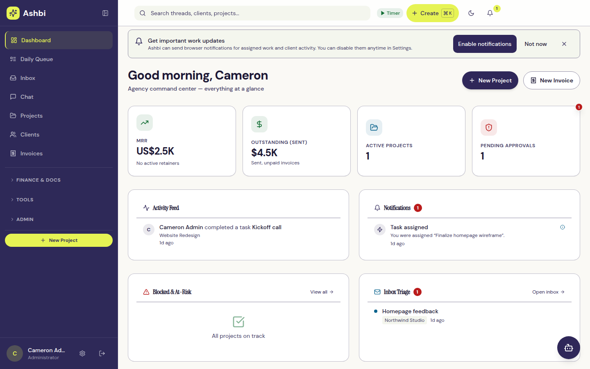
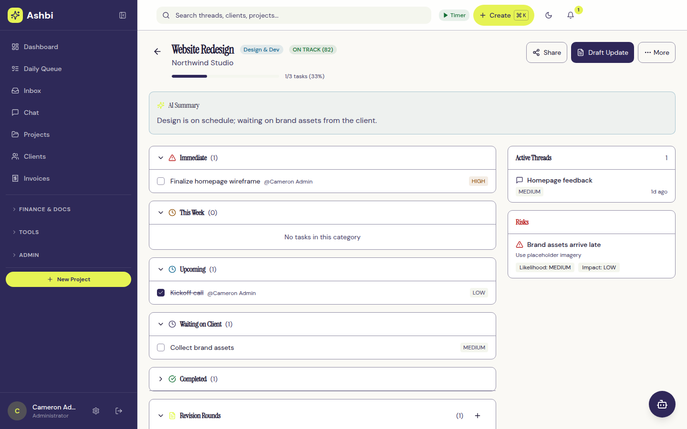

# Ashbi Hub

An all-in-one operations platform for a small creative agency: clients, projects, tasks, time, finance documents, team chat, media review and a client portal in one self-hosted app.

LLM integrations use the provider-free [workspace HTTP API and MCP tools](docs/workspace-api-mcp.md).
Embedded assistance is optional and hidden by default. A generated
[GPT Actions schema](docs/workspace-actions.openapi.json) is available for API-key clients.



## Why

Ashbi Design runs its client work across many separate tools (task boards, wikis, chat, screen recordings, design review, invoicing). Ashbi Hub brings that work into one multi-tenant app with a single permission model, an audit trail and a client-facing portal, so staff and clients see the same source of truth. It is built and used in-house; the honest, per-feature status of every capability lives in [docs/product-status.md](docs/product-status.md).

## Key features

- **Clients and CRM**: client records with contacts, health tracking, sales pipeline and intake forms.
- **Projects and tasks**: task lists and kanban boards, milestones, project templates, a project planner, and a daily operator queue that sorts open work into *Needs action*, *Awaiting approval*, *Waiting on client* and *At risk*.
- **Time tracking**: one running timer per user, manual entries, timesheets, approvals and locking of approved or invoiced time.
- **Finance documents**: proposals, contracts, estimates, invoices (per-organization numbering, Stripe checkout), expenses, retainers, rate cards and overdue invoice reminders.
- **Client portal**: clients sign in to see their own projects, shared files, reviews, invoices and proposals. Portal sessions are revoked immediately when a client is paused or a contact is removed, and internal data (budgets, AI summaries, risks) never reaches it.
- **Team chat with media**: per-project conversations where each message is *Internal* or *Visible to client*, with pasted screenshots, screenshot markup, and in-browser screen and camera recordings.
- **Media review**: review sessions over images, PDFs, video and recordings with pin, area, arrow and freehand markup, timestamped comments, versioning, client approval decisions and exportable evidence.
- **Docs and inbox**: a project wiki, an email inbox with threaded replies through a connected Gmail mailbox, and global and semantic search.
- **Governed AI**: Claude, Gemini or Ollama for summaries and drafting; an organization-level bring-your-own-key option with monthly budgets and kill switches; and an AI tool registry where anything that would change data becomes a pending action that a human approves.
- **Security and administration**: roles and tenancy, TOTP two-factor (enforceable per organization), step-up confirmation for sensitive actions, audited read-only support impersonation, an encrypted credential vault, upload validation policy and an append-only audit log.
- **Migration importers**: dry-run-first CLI importers for Notion, Slack, Loom, MarkUp.io, Bonsai and ClickUp exports, with reconciliation reports and rollback by run id where supported.
- **PWA**: installable web app with offline support for the public shell only. Private API data is never cached on the device.



## Tech stack

- **Frontend**: React 18, Vite, React Router, TanStack Query, Tailwind CSS, Socket.IO client, pdf.js
- **Backend**: Node.js 22, Fastify 5, Prisma 7, Zod validation, Socket.IO with a Redis adapter
- **Data**: PostgreSQL 16 with pgvector, Redis 7
- **Jobs**: BullMQ worker process
- **AI**: Anthropic Claude SDK, Google Gemini, Ollama, OpenAI-compatible providers (BYOK)
- **Integrations**: Stripe, Mailgun, Gmail and Google Calendar (googleapis), Slack, web push
- **Observability**: OpenTelemetry tracing, Sentry, pino logging
- **Quality**: TypeScript type checking (`tsc --noEmit`), ESLint, Node test runner, Vitest, Testing Library, Playwright (with axe accessibility checks), Lighthouse CI, CodeQL
- **Packaging**: Docker and Docker Compose

## Getting started

Prerequisites: Node.js 22 (see `.nvmrc`), PostgreSQL 16 with pgvector, and Redis 7+.

```bash
# Use the pinned Node version (if you use nvm)
nvm use

# Install backend and frontend dependencies
npm ci
npm ci --prefix web

# Create a local environment file from the template, then fill in the placeholders
cp .env.example .env

# Apply the committed migrations and generate the Prisma client
npx prisma migrate deploy
npm run db:generate

# The backend does not load .env on its own; export it into each backend/worker shell
set -a; source .env; set +a

# Start the API, the web app and the background worker (separate terminals)
npm run dev
npm run dev:web
npm run dev:worker
```

The API listens on `http://localhost:3000` and Vite serves the app on `http://localhost:5173`, proxying API and socket traffic. Create the first administrator with `POST /api/auth/register` using the `ADMIN_INVITE_TOKEN` you set in your local `.env`.

Prefer containers? `docker compose -f docker-compose.yml -f docker-compose.dev.yml up` runs the app, worker, PostgreSQL (pgvector) and Redis, with database and cache ports published to your machine for local tools.

Use `prisma db push` only against a disposable local database. Shared environments always use the committed migration chain.

## Testing

```bash
npm run verify:quick    # package boundaries, typecheck, lint, backend and frontend unit tests
npm run verify          # verify:quick plus integration tests and a production build
npm run verify:browser  # Playwright browser, public-route and PWA offline checks
npm run verify:release  # verify plus Lighthouse and release-policy checks
```

Full-stack end-to-end tests (PostgreSQL, Redis, worker and API in Docker):

```bash
npm run test:e2e:setup
npm run test:e2e
npm run test:e2e:teardown
```

Install browsers for Playwright once with `npx playwright install --with-deps chromium firefox webkit`. Visual regression baselines run with `npm run test:visual` (see [docs/visual-baselines.md](docs/visual-baselines.md)).

## Project structure

```
src/            Fastify backend
  domains/      route registrars grouped by domain (identity, revenue, client delivery, ...)
  routes/       API route modules
  services/     business logic
  ai/           AI providers, agents and the governed tool registry
  jobs/         BullMQ worker and background jobs
  realtime/     Socket.IO rooms and events
  security/     auth, step-up, credential vault and upload policy
  tests/        unit, integration and AI evaluation suites
web/            React + Vite frontend (pages, components, hooks)
prisma/         schema and committed migrations
scripts/        importers, generators and maintenance CLIs
tests/          Playwright browser, accessibility, PWA and visual tests
docs/           design and reference documentation
```

The backend's composition and domain boundaries are described in [docs/backend-application-boundaries.md](docs/backend-application-boundaries.md).

## Production

Production has one controller: the immutable direct-VPS procedure in [docs/deployment-and-rollback.md](docs/deployment-and-rollback.md). GitHub Actions and Coolify do not promote production. Every release uses the reviewed revision, archive checksum, immutable image ID, migration/status preflight, dependency-aware API/worker readiness, retained rollback containers, trusted HTTPS verification, and the encrypted backup policy in [docs/backup-and-restore.md](docs/backup-and-restore.md).

## Reference docs

Generated references are checked in CI so they never drift from the code:

- [docs/openapi.json](docs/openapi.json): OpenAPI 3.1 contract generated from the routes and their Zod validators (`npm run docs:openapi`), with conventions in [docs/api-contract.md](docs/api-contract.md)
- [docs/api-access-matrix.md](docs/api-access-matrix.md): every API route and its auth guard
- [docs/data-dictionary.md](docs/data-dictionary.md): every Prisma model with tenant scoping and fields (`npm run docs:data-dictionary`)

Contribution rules are in [CONTRIBUTING.md](CONTRIBUTING.md).

## License

[MIT](LICENSE)
